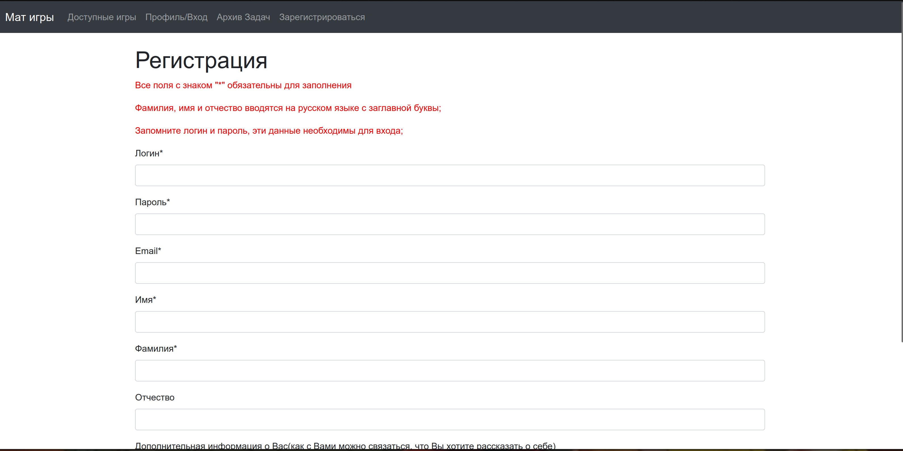

# Math Games
Как всегда инструкция по запуску в конце!!!
## Что за проект
Сайт математических игр. Люди могут регистрироваться на сайте, создавать 
игры: домино и пенальти, в формате личных или командных соревнований. Так же 
можно создавать команды и вступать в них, регистрироваться командой на 
соревнование и совместно участвовать в этом самом соревновании.

## Регистрация
Для начала необходимо зарегистрироваться на сайте. Раздел "Зарегистрироваться"
можно найти в шапке сайта.

При переходе в раздел открывается окно с формой для регистрации.
Форму необходимо заполнить в соответствии с указанными требованиями.
Фио должны быть указаны на русском языке с заглавных букв. Почта должна 
удовлетворять формату "only@acceptable.format". При не соблюдении какого-то 
из требований всплывает соответствующее уведомление.

При успешном заполнении нас перебрасывает на главную страницу

При попытке регистрации аккаунта с уже существующим логином всплывает 
предупреждение и регистрация является невозможной

P.S. Пароль, конечно же, хешируется, как и все остальные пароли, которые мы 
будем создавать в процессе.

## Профиль

При нажатии на вкладку Профиль/Вход нас перебрасывает в профиль, в который 
для начала нужно зайти 
### Вход

Просто вводим логин и пароль и входим, вводим не всё, или не правильно не 
входим.

После того как наконец войдём, окажемся в профиле
### Основной раздел

В общем и целом ничего интересного, наш логин ФИО, кнопка выхода из аккаунта,
при нажатии которой мы, что удивительно, из него выходим и перебрасываемся 
снова на раздел входа

Теперь подробнее про два доступных раздела.
### Игры

Изначально на вкладке только одна кнопка, так как мы пока ещё не создали ни 
одной игры. При нажатии создать игру открывается соответствующее окно.

Все поля в нём обязательны для заполнения, о чём обязательно предупредит сама 
форма, если вдруг что-то было не заполнено. 

Давайте всё же корректно заполним поля

Имя игры так же как и логин пользователя должны быть уникальны, так что 
создать две одноимённые игры не получится.

Когда мы создали игру данный раздел наполнился информацией. Теперь у нас 
есть наша игра и возможность её редактировать. 

Немного про отдельные поля:
* Общая информация - в целом понятно, нет смысла дополнительных разъяснений, 
кроме приватности. Приватные игры не доступны никому кроме автора, в том 
числе в разделе доступные игры. Ещё функционала я допилить не успел, так что 
приватность игре имеет смысл выставлять при создании и убирать когда все 
дополнительные настройки будут произведены
* О наборах задач - фича зависит от игры. Количество задач менять можно, но 
  не советую, так как они строго зафиксированы правилами, а вот количество 
  наборов менять можно. 
  * В Домино количество наборов это сколько экземпляров 
    каждой задачи существует: когда команда берёт задачу, общее количество 
    экземпляров доступных другим командам уменьшается (если их 0, то задачу 
    взять нельзя), а когда сдаёт, то увеличивается.
  * В Пенальти количество наборов это сколько раз стоимость задачи не будет 
    падать, после успешной сдачи с первой попытки. К примеру: изначально 
    задача стоит 9 баллов и набора 2, её успешно сдала 1 команда, стоимость 
    всё ещё 9, теперь сдала ещё одна и стоимость уже 8, потом для следующих 
    двух команд стоимость будет 8, а для команды за ними уже 7 и т.д.
* Авторы - тут, в теории, можно добавлять авторов, чтобы вместе с ними 
  делать игры, но особо не тестировалось, так что может положить сайт...
* Размеры команды - если игра личная, то стоят прочерки, если игра командная,
  то позволяет регулировать сколько игроков может быть в команде, чтобы 
  возможно было зарегистрироваться на игру
* Информация о задачах - можно добавлять задачи и менять их на другие. Если 
  задача не скрыта, то она отображается в "Архиве Задач", так что для ещё не 
  прошедших игр желательно делать задачи скрытыми, чтобы не слить их :^) 

В целом в каждом разделе по кнопке "Изменить" всё либо и так понятно, либо 
расписано и добавлять это всё в README не очень-то хочется.

В целом и общем у всё тоже самое, только задач 16 и нумеруются они в самом 
обычном порядке

### Команды

Здесь мы видим две формы для создания и вступления в команду.
Механика проста: капитан создаёт команду, сообщает логин и пароль тиммейтам, 
они их вводят и успешно вступают в команду. Только капитан может 
регистрировать команду и сдавать задачи.

## Игры
###  Доступные игры
При входе в этот раздел пользователь видит все игры которые ему доступны. То 
есть

* Они ещё не закончились
* Они не приватные
* Если они командные, то он является капитаном команды, которая обладает допустимым составом
  * никто из членов не зарегистрирован на игру в составе другой команды
  * количество членов команды удовлетворяет требованиям

После регистрации можно перейти к игре по соответствущей кнопке

Ну и теперь самое интересное - сами игры (внимание, если в игру не добавить 
все задачи и попытаться потом зайти в неё, то всё упадёт, что логично, так 
как зачем публиковать игру без задач, автор?..)
Видим таймер отсчёта до начала игры

Дождавшись начала получаем рекомендацию обновить страницу
 
И вот мы уже играем в игру. Сдаём задачи, получаем сообщения об успехе/поражении
### Пенальти
 
 
В таблице нет задач со второй попытки, так как нормальный ответ я ставил 
только первой, для остальных забыл, а так как они захешированы то поглядеть 
быстро не могу.
 
Когда игра закончится при попытке отправить ответ/обновить страницу появится 
следующее
 
### Домино
 
 
В домино можно брать не больше 2-ух задач. Зелёный - сданные, красные - 
попыток больше нет, жёлтые - есть одна попытка.
Баллы выставляются согласно правилам игры.

 
## Как запустить
А никак. А если точнее, я сделал докер образ и залил на сервер, так что вот 
ссылка
http://194.67.97.108:56733/
## Доп баллы
Докер образ
То, что ты указывал не реализовал, 
но вроде много других прикольных деталей

Iv@n0vanDadyachka